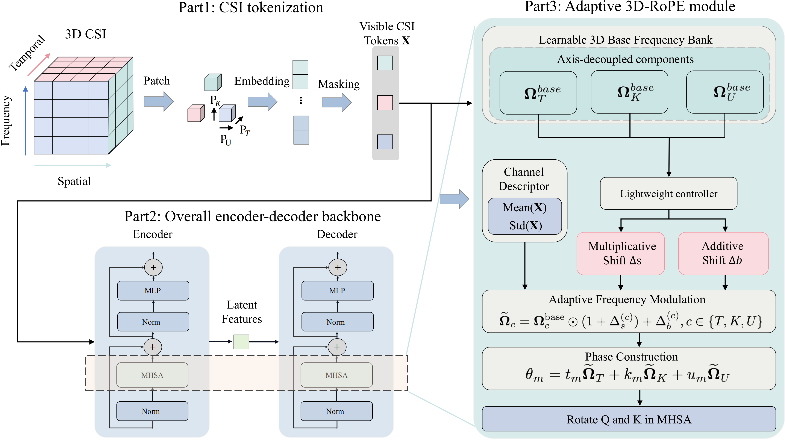

# Adaptive 3D-RoPE: Physics-Aligned Rotary Positional Encoding for Wireless Foundation Models

## Abstract

Positional encoding plays a pivotal role in determining the extrapolation and generalization performance of wireless foundation models for channel state information (CSI) modeling, latent characterization, and task-specific prediction. However, existing CSI models inherit static or one-dimensional positional priors from natural language and vision architectures, which fundamentally misalign with the intrinsic physics of wireless channels by lacking explicit relative decay, collapsing the 3D spatio-temporal-frequency structure, and remaining scenariorigid. This paper proposes Adaptive 3D-RoPE, a physics-aligned rotary positional encoding that establishes the structural cornerstone for wireless foundation models. The framework integrates a learnable, axis-decoupled 3D frequency bank to explicitly disentangle multi-dimensional phase dependencies, coupled with a lightweight channel-conditioned controller that dynamically modulates the prior via compact global CSI descriptors. This sample-adaptive mechanism transforms positional encoding from a static transformer component into a dynamic, coherence-aware inductive bias to resolve heterogeneous channel physics. Extensive experiments across 100 datasets demonstrate the superiority of the proposed scheme in both scale extrapolation and zero-shot generalization. Compared to the state-of-the-art, our method achieves up to a 10.7 dB reduction in normalized mean square error (NMSE) under 8× antenna scale extrapolation. Given the same CSI input scales, our method can also improve zero-shot NMSE by 1.07 dB across unseen mobility scenarios and 0.90 dB in low-frequency-to-millimeter-wave tasks.

## Method Overview

The codebase provides one unified CSI MAE model with configurable positional encoding:

- `rope_mode=none`: No RoPE
- `rope_mode=learnable`: learnable 3D-RoPE
- `rope_mode=fixed`: fixed 3D-RoPE
- `rope_mode=adaptive`: Adaptive 3D-RoPE with a dynamic controller

## Installation

- Python 3.10 (Recommend to use Anaconda)
- Install Python dependencies by running:

```bash
pip install -r requirements.txt
```

## Dataset
### Pretrain Dataset
https://huggingface.co/datasets/Chenyu8998/adaptive-3d-rope/train

###  Expected Data Layout

The loaders expect:

```text
DATA_DIR/
  D1/
    train_data.mat
    val_data.mat
    test_data.mat
    config.mat
  D2/
    ...
```

Each `.mat` file should contain `H_train`, `H_val`, or `H_test`.

## Core Commands

Train:

```bash
python cli.py train \
  --model csi_mae_base \
  --rope_mode adaptive \
  --encoder_pe complex_rotation \
  --decoder_pe sincos_3d \
  --dataset D1,D2,D3,D4 \
  --data_dir /path/to/csidata \
  --mask_type random \
  --mask_ratio 0.85 \
  --batch_size 32 \
  --epochs 150 \
  --output_dir ./outputs/train
```

Evaluate:

```bash
python cli.py eval \
  --resume /path/to/checkpoint.pth \
  --model csi_mae_base \
  --rope_mode adaptive \
  --encoder_pe complex_rotation \
  --decoder_pe sincos_3d \
  --dataset D1,D2,D3,D4 \
  --data_dir /path/to/csidata \
  --mask_type random \
  --mask_ratio 0.85 \
  --output_dir ./outputs/eval
```

Few-shot fine-tune:

```bash
python cli.py finetune \
  --finetune /path/to/source_checkpoint.pth \
  --model csi_mae_base \
  --rope_mode adaptive \
  --encoder_pe complex_rotation \
  --decoder_pe sincos_3d \
  --dataset D17 \
  --data_dir /path/to/csidata \
  --data_num 0.1 \
  --batch_size 32 \
  --epochs 20 \
  --output_dir ./outputs/finetune
```

`finetune` can also start from scratch if `--finetune` is omitted, but the recommended workflow is to initialize from a source-domain checkpoint.

## Key Arguments

- `--model`: `csi_mae_base`, `csi_mae_small`, `csi_mae_tiny`
- `--rope_mode`: `none`, `learnable`, `fixed`, `adaptive`
- `--encoder_pe`: `complex_rotation`, `complex_rotation_3d`, `trivial`, `sincos`, `sincos_2d`, `sincos_3d`, `sincos_1d_3`, `none`
- `--decoder_pe`: same choices as `--encoder_pe`
- `--rope_theta`: single value like `10` or triplet like `10,100,1000`
- `--rope_use_ape`: enable absolute positional encoding alongside RoPE
- `--use_phys_coord`: load dataset-level physical metadata when available

## Outputs

- Training writes checkpoints to `output_dir/checkpoint-*.pth`
- The final training checkpoint is `output_dir/checkpoint-final.pth`
- Training metrics are appended to `output_dir/train_metrics.csv`
- Evaluation writes `output_dir/eval_metrics.json` and `output_dir/eval_summary.txt`

## License

This project is released under the MIT License. See `LICENSE`.

## Citation
If you found our project helpful, please kindly cite our paper:
```
@article{zhang2026adaptive,
  title={Adaptive 3D-RoPE: Physics-Aligned Rotary Positional Encoding for Wireless Foundation Models},
  author={Zhang, Chenyu and Lyu, Xinchen and Ren, Chenshan and Liu, Shuhan and Cui, Qimei},
  journal={arXiv preprint arXiv:2605.00968},
  year={2026}
}
```