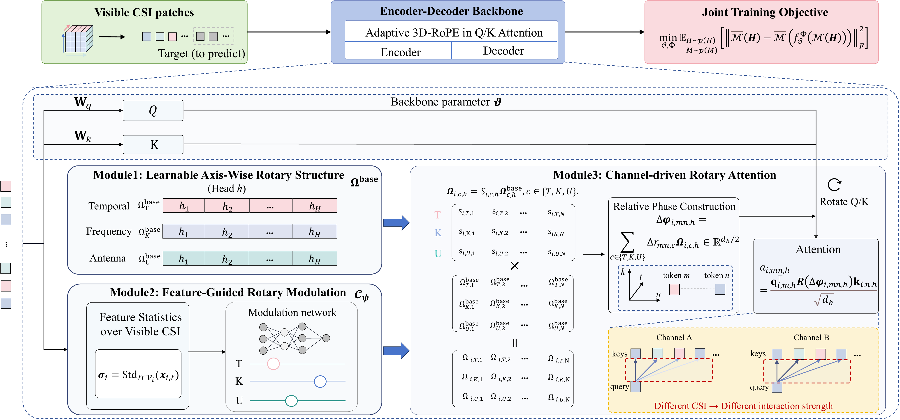

# Adaptive 3D-RoPE

Adaptive 3D-RoPE is a CSI masked-autoencoder with rotary positional encoding whose frequency scales are predicted from visible CSI tokens. This repository contains the reproducible core implementation, six positional-encoding profiles, and the DeepMIMO/MaMIMO/QuaDRiGa preparation and baseline entry points.



## Install

Use Python 3.11 and install a PyTorch 2.4.1 wheel matching your CPU or CUDA driver, then install the pinned dependencies:

```bash
python -m pip install -r requirements.txt
```

The released environment was validated with PyTorch 2.4.1+cu121 on an NVIDIA H800. CUDA is optional for the unit tests.

## Data layout

CSI data is not redistributed. Set `DATA_ROOT` to a local directory containing one or more datasets in this layout:

```text
DATA_ROOT/
  D1/{train,val,test}_data.mat
  D1/config.mat
```

Use the scripts in `data_generation/` to prepare compatible derived data. Original QuaDRiGa, DeepMIMO and MaMIMO-UAV data remain subject to their own licenses and download terms.

## Profiles and evaluation

`configs/position_encoding_profiles.yaml` defines six released profiles:

| Profile | Positional encoding |
| --- | --- |
| `ape_1d` | 1D sinusoidal APE |
| `ape_3d` | 3D sinusoidal APE |
| `fixed_1d` | fixed 1D RoPE |
| `fixed_3d` | fixed 3D RoPE |
| `learnable_3d` | learnable 3D RoPE |
| `proposed_std_only` | adaptive 3D-RoPE |

Download a matching checkpoint from the [Hugging Face model repository](https://huggingface.co/Chenyu8998/adaptive-3d-rope), then evaluate it by selecting the same profile:

```bash
python cli.py eval --profile proposed_std_only \
  --data_dir "$DATA_ROOT" --dataset D1 \
  --resume checkpoints/proposed_std_only/checkpoint-149.pth \
  --output_dir outputs/proposed_std_only
```

To compare another positional encoding, change both `--profile` and the checkpoint directory:

```bash
python cli.py eval --profile ape_3d --data_dir "$DATA_ROOT" --dataset D1 \
  --resume checkpoints/ape_3d/checkpoint-149.pth --output_dir outputs/ape_3d
python cli.py eval --profile fixed_1d --data_dir "$DATA_ROOT" --dataset D1 \
  --resume checkpoints/fixed_1d/checkpoint-149.pth --output_dir outputs/fixed_1d
```

The loader checks saved checkpoint arguments against the selected profile and uses strict state-dict loading. Do not mix profiles and checkpoints.

The proposed profile is pure RoPE: `encoder_pe=none`, `decoder_pe=none`, `rope_mode=adaptive`, `rope_axes=3d`, and a visible-only `token_std` controller.

## Training

Train any profile from scratch with the same profile switch:

```bash
python cli.py train --profile proposed_std_only --data_dir "$DATA_ROOT" \
  --dataset D1 --epochs 150 --output_dir outputs/train_proposed
```

`finetune` and `calibrate_controller` use the same profile contract.

## DeepMIMO and data preparation

`deepmimo_train` and `deepmimo_eval` expose the reusable encoder and MLP, CNN, LSTM, beam-codebook, CsiNet and TransNet baselines. They require a local DeepMIMO scenario and task arrays; use `--baseline` for a baseline or `--profile ... --pretrained ... --baseline ours` for encoder transfer.

The `data_generation/` scripts are public preparation interfaces only: `generate_extrapolation_v3.m` and `generate_controlled_quadriga_diagnostics.m` use a user-supplied QuaDRiGa installation, while `deepmimo/` and `mamimo_uav/` prepare derived arrays without shipping source data.

The optional LWM beam scripts under `scripts/` require a separately obtained LWM 1.1 pretraining checkpoint and do not consume the six CSI-MAE weights.

## Weights and checksums

The six public weights are hosted at `https://huggingface.co/Chenyu8998/adaptive-3d-rope`. Download them with Git LFS or the Hugging Face web interface. Verify every file before evaluation:

```bash
sha256sum -c checksums.sha256
```

The repository intentionally tracks no data, model weights, training outputs or large binaries. Hugging Face model files include the profile configuration and the same SHA-256 manifest.

## Citation and license

Please cite the accompanying Adaptive 3D-RoPE paper when using this code. The code is released under the license in [LICENSE](LICENSE); third-party notices are collected in [NOTICE](NOTICE) and the dataset-specific notices under `datasets/`.
